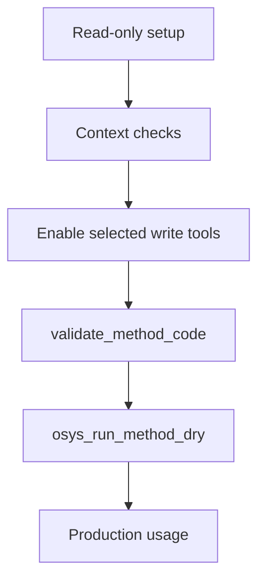

# MCP clients: VS Code, Cursor и другие

> [!NOTE]
> Документ покрывает подключение клиентов к `http://127.0.0.1:5000/api/mcp`.

## Содержание

- [Общий принцип подключения](#общий-принцип-подключения)
- [VS Code](#vs-code)
- [Cursor](#cursor)
- [Visual Studio и другие IDE](#visual-studio-и-другие-ide)
- [Ручная проверка](#ручная-проверка)
- [Безопасность](#безопасность)
- [Стратегия внедрения](#стратегия-внедрения)
- [Полезные ссылки](#полезные-ссылки)

---

## Общий принцип подключения

| Параметр | Значение |
| :--- | :--- |
| Endpoint | `http://127.0.0.1:5000/api/mcp` |
| Transport | HTTP (MCP JSON-RPC) |
| Auth | `Authorization: Bearer <token>` или `X-MCP-Token: <token>` |

1. Включить модуль `MCP Server` в osysHome.
2. Настроить токен в админке (рекомендуется).
3. Проверить `GET /api/mcp`.
4. Подключить клиент.
5. Выполнить `initialize` + `tools/list` + `resources/list`.

> `tools/list` отдаёт только инструменты, разрешённые токену (`allow_*` в админке). Полный каталог — `osys_server_capabilities` или resource `osys://server/capabilities`.

## VS Code

> [!TIP]
> Чаще всего используется `.vscode/mcp.json` в workspace.

```json
{
  "servers": {
    "osysHome": {
      "type": "http",
      "url": "http://127.0.0.1:5000/api/mcp",
      "headers": {
        "Authorization": "Bearer ${input:osysMcpToken}"
      }
    }
  },
  "inputs": [
    {
      "id": "osysMcpToken",
      "type": "promptString",
      "description": "osysHome MCP token",
      "password": true
    }
  ]
}
```

Проверка:

- [ ] Reload window
- [ ] Сервер `osysHome` отображается как connected
- [ ] `tools/list` возвращает MCP tools

## Cursor

```json
{
  "mcpServers": {
    "osysHome": {
      "transport": {
        "type": "http",
        "url": "http://127.0.0.1:5000/api/mcp",
        "headers": {
          "Authorization": "Bearer YOUR_TOKEN_HERE"
        }
      }
    }
  }
}
```

> [!WARNING]
> В разных версиях Cursor формат может отличаться.  
> Если не подключается, сверяйтесь с актуальной встроенной справкой Cursor.

## Visual Studio и другие IDE

Используйте те же параметры:

- protocol: `MCP over HTTP JSON-RPC`
- endpoint: `http://127.0.0.1:5000/api/mcp`
- auth header: `Authorization` или `X-MCP-Token`

<details>
<summary><strong>Минимальный smoke test</strong></summary>

1. `initialize`
2. `tools/list`
3. `resources/list`

</details>

## Ручная проверка

### PowerShell

```powershell
$url = "http://127.0.0.1:5000/api/mcp"
$headers = @{ Authorization = "Bearer YOUR_TOKEN_HERE" }
$body = @{
  jsonrpc = "2.0"
  id = 1
  method = "tools/list"
  params = @{}
} | ConvertTo-Json -Depth 10

Invoke-RestMethod -Method Post -Uri $url -Headers $headers -ContentType "application/json" -Body $body
```

### cURL

```bash
curl -X POST http://127.0.0.1:5000/api/mcp \
  -H "Content-Type: application/json" \
  -H "Authorization: Bearer YOUR_TOKEN_HERE" \
  -d '{"jsonrpc":"2.0","id":1,"method":"tools/list","params":{}}'
```

## Безопасность

> [!CAUTION]
> Не храните рабочие токены в репозитории или в открытых конфигурациях.

- Используйте разные токены для dev/prod.
- Начинайте с read-only модели.
- Включайте только нужные флаги:
  - `allow_write_tools`
  - `allow_method_calls`
  - `allow_logs_access` (логи могут содержать секреты)
  - `allow_source_access` (раскрывает исходный код `app/` и `plugins/`)
  - `allow_manage_*`
- Для документации добавьте `Docs` в `plugins_allowed` и используйте plugin MCP tools.

## Стратегия внедрения



1. Подключить клиента только на чтение.
2. Проверить контекст (`osys_get_class`, `osys_get_template_spec`, `osys_plugin_list_entities` для Docs, `osys://method-runtime/spec`).
3. Включить точечно нужные write-операции.
4. Для method-code всегда выполнять `osys_validate_method_code` -> `osys_run_method_dry`.
5. Только потом применять изменения.

## Полезные ссылки

- VS Code MCP configuration reference: https://code.visualstudio.com/docs/copilot/reference/mcp-configuration
- VS Code MCP overview: https://code.visualstudio.com/docs/copilot/chat/mcp-servers
- Cursor MCP docs: https://docs.cursor.com/en/context/model-context-protocol

<kbd>Ctrl</kbd>+<kbd>C</kbd> можно использовать для копирования команд из примеров.
