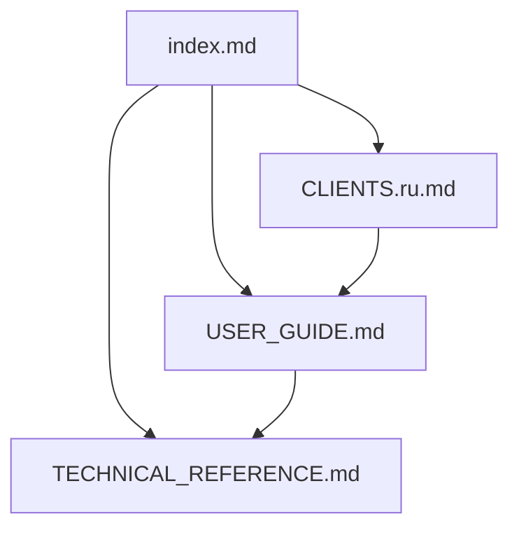

# MCPServer docs index

Quick navigation for MCPServer documentation in osysHome.

> [!TIP]
> Start with the [User Guide](./USER_GUIDE.md), then move to [Technical Reference](./TECHNICAL_REFERENCE.md).

## Quick links

| Section | Audience | Link |
| :--- | :--- | :--- |
| Setup and operations | Admin / Integrator | [USER_GUIDE.md](./USER_GUIDE.md) |
| API contract and internals | Developer | [TECHNICAL_REFERENCE.md](./TECHNICAL_REFERENCE.md) |
| IDE/MCP client setup | End user | [CLIENTS.ru.md](./CLIENTS.ru.md) (RU) |
| Source & docs tools | Developer / Integrator | [TECHNICAL_REFERENCE.md](./TECHNICAL_REFERENCE.md#documentation-tools) |

## RU docs

- [Russian User Guide](./USER_GUIDE.ru.md)
- [Russian Technical Reference](./TECHNICAL_REFERENCE.ru.md)
- [Russian docs index](./index.ru.md)

## Document map

